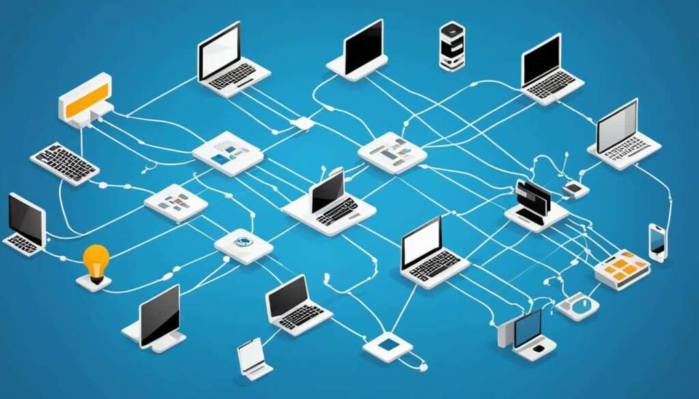
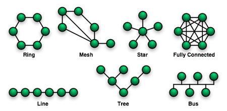
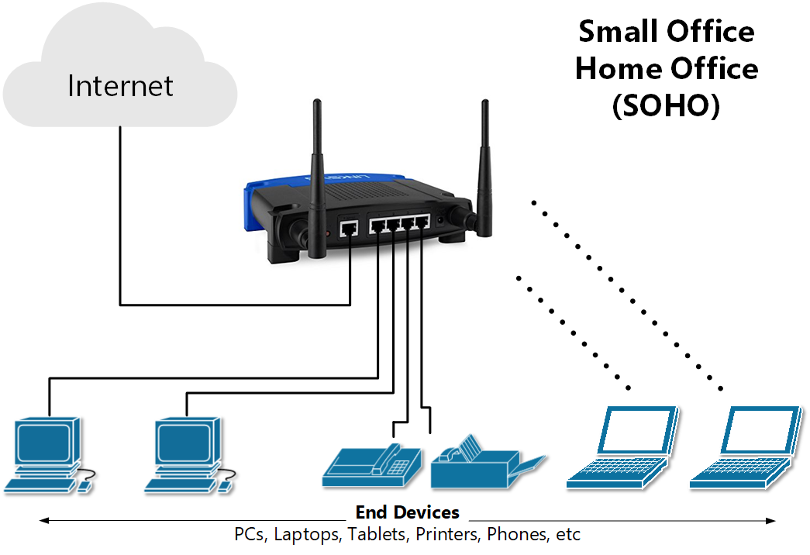
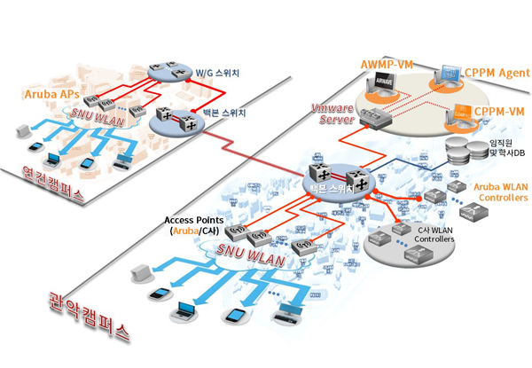
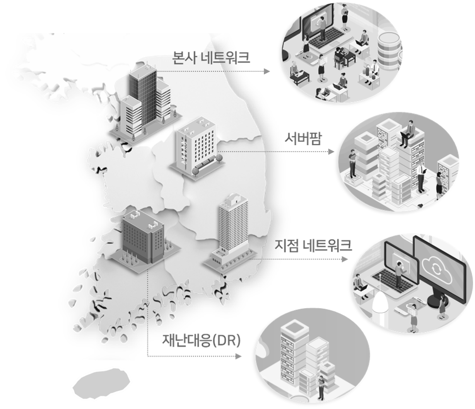
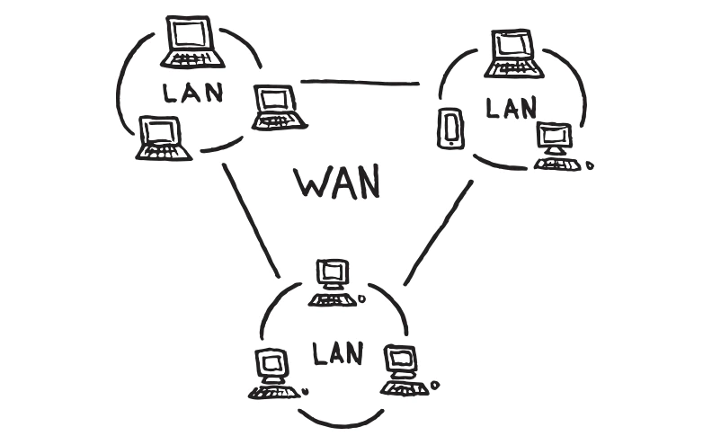
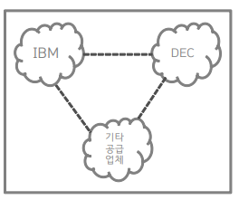
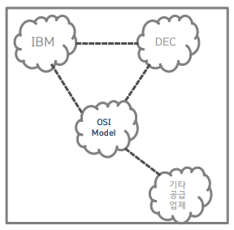
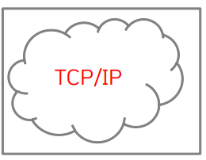
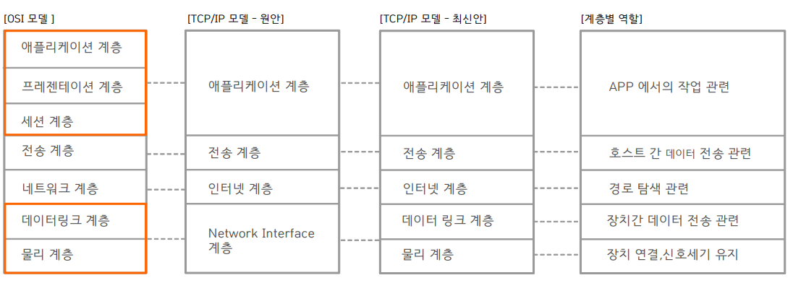

# 네트워크 기본


NETWORK
---
> 데이터 교환을 위해 통신장치를 연결한 통신망<br>

```
NET  : 망(그물모양)
WORK : 일하다,작업하다
NETWORK : 망을 만드는 작업
```

|-|-|
|-|-|
|||

---
#
---

NETWORK 연결형태
---
> 토폴로지 확인<br>

|-|
|-|
||

|-|-|-|
|-|-|-|
|-|RING형|각 링크가 단방향이어서 데이타는 한 방향으로만 전송<br>각 노드는 데이타의 송수신을 제어하는 엑세스 제어논리(토큰)을 보유|
|-|STAR형|중앙집중식 구조<br>중앙의 교환장비가 데이타 경로를 개설하고 유도<br>이용자의 스테이션은 중앙의 교환장비에 point-to-point 링크로 연결|
|-|TREE형|지역과 거리에 따라 연결하므로 통신선로의 총경로가 가장 짧음<br>접속되는 단말기의 숫자에 맞는 통신장비 이용이 가능|
|-|MESH형|네트워크상의 모든 노드를 상호 연결<br>통신선로의 총길이가 가장 긴 네트워크 구조<br>초기 데이타 통신 네트워크의 전형적인 형태<br>공중통신망에 많이 사용|
|-|BUS형|어떠한 통신망에서 선을 따 통신선으로 끌어다가 쓰는 방식이다. 멀티탭의 원리와 동일하다고 보면 된다.<br>필요할때마다 선을 끌어쓰면 되기 때문에 기기가 추가될때마다 <br>추가적인 회선을 깔 필요가 없어져 구축비용을 아낄 수 있다. <br>하지만 한 선에 데이터가 몰리게 된다면, 병목 현상이 일어나게 된다|


---
#
---

NETWORK 종류
---
> LAN(Local Area Network <br>
```
AN(근거리 통신망)은 비교적 작은 지리적 범위 내에 있는 컴퓨터와 네트워크 장치들을 상호 연결하여 데이터를 주고받을 수 있도록 하는 네트워크입니다.
주로 가정, 사무실, 학교, 소규모 기업에서 사용되며, 네트워크의 크기는 한 방 또는 여러 인접한 방에 걸쳐 있을 수 있습니다.
```
>  > LAN 주요 특징 <br>
```
지리적 범위: 제한된 지리적 범위 내에서 운영되며, 보통 한 건물이나 인접한 건물 내에서 사용됩니다.
속도: 높은 데이터 전송 속도를 제공합니다. 일반적으로 100 Mbps, 1 Gbps, 10 Gbps 등.
비용: 설치와 운영 비용이 비교적 낮습니다.
관리 용이성: 네트워크 관리가 상대적으로 쉽고, 설치와 유지 보수가 간단합니다.
보안: 제한된 범위 내에서 작동하므로 외부 네트워크에 비해 보안이 더 용이합니다.
```

> > LAN 구성 요소 <br>
```
네트워크 어댑터 (Network Interface Card, NIC)
  역할: 컴퓨터나 장치가 네트워크에 연결되도록 합니다.
  기능: 유선(이더넷) 또는 무선(Wi-Fi) 방식으로 네트워크에 연결.

스위치 (Switch)
  역할: 네트워크 장치들을 연결하고 데이터 패킷을 전송합니다.
  기능: 데이터 패킷을 목적지 주소에 따라 적절한 포트로 전달.

라우터 (Router)
  역할: LAN을 다른 네트워크(예: 인터넷)와 연결합니다.
  기능: 트래픽 관리, IP 주소 할당(DHCP), 보안 기능(방화벽).

무선 액세스 포인트 (Wireless Access Points)
  역할: 무선 장치들이 네트워크에 접속할 수 있도록 합니다.
  기능: Wi-Fi 신호를 제공하여 스마트폰, 태블릿, 노트북 등을 연결.

케이블 (Cables)
  역할: 네트워크 장치들을 물리적으로 연결합니다.
  유형: UTP 케이블(Cat5e, Cat6 등), 광섬유 케이블 등.

허브 (Hub)
  역할: 여러 네트워크 장치를 연결하여 데이터 패킷을 전송합니다.
  기능: 패킷을 연결된 모든 장치에 전달하지만, 오늘날에는 스위치가 허브를 대체.

서버 (Servers)
  역할: 네트워크 사용자에게 다양한 서비스를 제공합니다.
  기능: 파일 저장, 웹 서비스, 데이터베이스, 애플리케이션 호스팅 등.

```


> > LAN 종류 <br>

|SOHO|CAMPUS LAN|ENTERPRISE LAN|
|-|-|-|
||||
|SOHO는 소규모 사무실 또는 가정 사무실<br>개인 사업자, 프리랜서, 소규모 기업 등이 주로 사용하는 네트워크 환경<br>작고 간단하지만, 안정적이고 효율적인 업무 처리를 위해 신뢰성과 보안이 중요|대학교, 기업 캠퍼스와 같은 넓은 지역을 커버하는 LAN으로, 여러 건물을 연결하는 대규모 LAN<br>고성능 백본 네트워크를 통해 여러 빌딩의 네트워크를 통합 관리<br>대규모 사용자 지원, 높은 대역폭 제공|대규모 기업 환경에서 사용되는 근거리 통신망<br>다양한 지점이나 부서, 빌딩을 연결하여 고성능, 보안성, 확장성을 제공하는 네트워크|

```
[기타]
  클라우드 관리 LAN (Cloud-managed LAN)
    특징: 네트워크 장비와 설정을 클라우드에서 관리할 수 있는 LAN입니다. 클라우드 기반 관리 플랫폼을 통해 네트워크를 설정하고 모니터링합니다.
    장점: 중앙집중식 관리, 원격 모니터링 및 설정 변경이 용이, 유지보수 비용 절감.
    용도: 다수의 지사나 원격 위치에서 네트워크를 쉽게 관리해야 하는 경우.
  데이터센터 LAN (Data Center LAN)
    특징: 데이터센터 내에서 서버, 스토리지, 네트워크 장치를 상호 연결하는 고속 LAN입니다.
    구성: 고대역폭, 저지연 네트워크로 설계되며, 종종 고속 이더넷(10 Gbps 이상) 및 광섬유 연결을 사용합니다.
    장점: 높은 신뢰성, 빠른 데이터 전송 속도, 확장성.
```


> WAN(Wide Area Network) <br>

```
WAN(광역 통신망)은 지리적으로 넓은 범위에 걸쳐 있는 네트워크로, 서로 떨어져 있는 지역(도시, 국가, 대륙 등)을 연결하는 데 사용됩니다.
WAN은 여러 로컬 영역 네트워크(LAN)와 다른 유형의 네트워크를 연결하여 데이터, 음성, 영상 등의 정보를 주고받을 수 있도록 합니다.
```

|-|
|-|
||

> > WAN 주요 특징 
```
  광범위한 커버리지: 지리적으로 넓은 지역을 커버하며, 지역, 국가, 대륙 간 네트워크 연결을 지원합니다.
  다양한 기술 사용: 다양한 전송 기술(유선 및 무선)을 사용하여 데이터를 전송합니다. 예를 들어, MPLS, 전용 회선, 위성 링크 등이 있습니다.
  인터넷 연결: 공용 인터넷을 통해 WAN 연결을 설정하는 경우가 많으며, VPN(가상 사설망)을 통해 보안이 강화된 연결을 제공합니다.
  높은 비용: 광범위한 네트워크 인프라와 전송 기술로 인해 운영 비용이 높을 수 있습니다.
  관리 복잡성: 대규모 네트워크를 관리하기 위해 전문 지식과 복잡한 네트워크 관리가 필요합니다.
```

> > WAN 구성 요소
```
라우터 (Routers)
  역할: LAN과 WAN을 연결하고, 데이터를 올바른 경로로 전달합니다.
  기능: 패킷 포워딩, 경로 선택, 트래픽 관리 등.

전송 매체 (Transmission Media)
  유선: 광섬유, 동축 케이블, 전용 회선 등.
  무선: 위성 링크, 마이크로파, LTE/5G 등.

스위치 (Switches)
  역할: 데이터 패킷을 올바른 포트로 전달하며, 주로 LAN에서 사용되지만 WAN의 일부 구성 요소로도 사용됩니다.

모뎀 (Modems)
  역할: 디지털 신호를 아날로그 신호로 변환하여 전송하고, 다시 디지털 신호로 변환합니다.
  기능: DSL 모뎀, 케이블 모뎀 등.

WAN 연결 장비
  예: CSU/DSU(Channel Service Unit/Data Service Unit), MPLS 장비 등.
  역할: WAN 링크를 통해 데이터를 전송하고 관리합니다.

```

> > WAN 의 기술
```
전용 회선 (Leased Lines)
  특징: 고정 대역폭을 제공하며, 항상 연결되어 있는 상태를 유지합니다.
  장점: 안정적이고 신뢰성이 높음.
  단점: 비용이 높음.

프레임 릴레이 (Frame Relay)
  특징: 패킷 스위칭 기술로, 여러 데이터 링크를 통해 데이터를 전송합니다.
  장점: 비용 효율적.
  단점: 안정성과 속도면에서 전용 회선보다 낮음.

MPLS (Multiprotocol Label Switching)
  특징: 패킷에 라벨을 붙여 경로를 지정하며, 데이터 전송을 효율적으로 관리합니다.
  장점: 높은 성능과 유연성.
  단점: 설정과 관리가 복잡함.

VPN (Virtual Private Network)
  특징: 공용 인터넷을 통해 사설 네트워크를 구축하여 보안이 강화된 통신을 제공합니다.
  장점: 비용 효율적이고 보안성이 높음.
  단점: 인터넷 품질에 따라 성능이 영향을 받을 수 있음.

SD-WAN (Software-Defined WAN)
  특징: 소프트웨어 정의 네트워킹(SDN) 기술을 사용하여 WAN 연결을 중앙에서 관리하고 최적화합니다.
  장점: 유연성, 비용 절감, 성능 최적화.
  단점: 초기 설정이 복잡할 수 있음
```

---
#
---


INTERNET
---
> 인터넷(INTERNET)<br>
```
정의: 인터넷은 전 세계적으로 연결된 컴퓨터 네트워크의 집합으로, 다양한 공공 및 개인 네트워크들이 상호 연결되어 있습니다.
특징: 글로벌 연결성: 전 세계적으로 컴퓨터와 네트워크를 연결합니다.
공개적 : 공개적으로 접근 가능한 네트워크로, 누구나 인터넷에 연결하여 정보를 주고받을 수 있습니다.
사용 예 : 웹 브라우징, 이메일, 파일 전송, 스트리밍, 클라우드 서비스 등 다양한 서비스를 제공합니다.
```

> 인트라넷(Extranet)<br>
```
정의 : 인트라넷은 조직 내부에서 사용되는 사설 네트워크로, 특정 조직 또는 기업 내부에서만 접근 가능합니다.
특징 : 조직 내부용: 특정 조직의 직원들만 접근 가능한 네트워크로, 인터넷과는 격리되어 있습니다.
보안성 : 조직의 보안 정책에 따라 접근 권한이 제어되고, 보안이 강화됩니다.
사용 예: 내부 문서 공유, 업무 프로세스 관리, 내부 커뮤니케이션 등 조직 내부에서의 정보 공유와 협업에 사용됩니다.
```

> 익스트라넷(Extranet)<br>
```
정의 : 익스트라넷은 두 조직 또는 기관 간에 안전하게 정보를 공유하기 위해 사용되는 네트워크로, 인트라넷과 비슷하지만 조직 간에 접근이 가능합니다.
특징 : 조직 간 연결: 두 조직이나 기관 간에 안전하게 정보를 공유하고 협업할 수 있습니다.
보안성 : 공유되는 정보는 보안 접근 권한에 따라 제어되며, 외부의 무단 접근을 방지합니다.
사용 예 : 거래처와의 주문 및 결제, 공급망 관리, 파트너사와의 협업 등 조직 간의 비즈니스 프로세스를 효율적으로 관리합니다.
```


---
#
---


PROTOCOL
---

> PROTOCOL이란
---
```
네트워크 환경에서 데이터 통신을 위한 규칙이나 규약
컴퓨터나 기타 장치들이 서로 통신하기 위해 지켜야 하는 규칙의 집합
데이터를 보내고 받는 방법, 데이터의 형식, 에러 처리 등의 다양한 측면을 다룸
```

> PROTOCOL 요소
---

> 구문(Syntax) <br>
```
정의: 프로토콜은 데이터의 구문적인 형식을 정의합니다. 이는 데이터가 어떻게 구조화되어야 하는지와 어떤 형식으로 표현되어야 하는지를 명시합니다.
중요성: 프로토콜의 구문을 준수하는 모든 장치들은 일관된 데이터 형식을 유지하고, 데이터를 올바르게 해석할 수 있습니다.
```

> 의미(Meaning) <br>
```
정의: 프로토콜은 데이터의 의미와 목적을 정의합니다. 데이터가 어떤 의미를 가지고 있으며, 해당 데이터가 수행해야 하는 동작이나 작업을 명확히 합니다.
중요성: 데이터의 의미를 이해하는 것은 통신하는 장치들이 데이터를 올바르게 해석하고 응답할 수 있도록 합니다.
```

> 타이밍(Timing)<br>
```
정의: 프로토콜은 데이터 전송 및 처리의 타이밍을 제어합니다. 데이터 전송, 응답 시간, 재전송 등의 시간적인 측면을 관리합니다.
중요성: 올바른 타이밍은 통신의 효율성과 안정성을 보장하며, 불필요한 대기 시간을 최소화하여 성능을 향상시킵니다.
```

---
#
---

NETWORK MODEL
---
> 네트워크 모델 <br>
```
네트워크를 구축하는 데 필요한 설계도
효율적인 네트워크 설계를 위한 모델
장애 발생시 문제 원인 탐색 용이
```

> 네트워크 모델의 변화 <br>
```
1 공급업체들간의 각각 다른 형태의 네트워크 모델이 존재
2 OSI 7Layer 통한 전세계 모든 컴퓨터 네트워킹의 표준화 모델제시
3 현재는 TCP/IP 모델을 현재는 널리 사용
```


|-|-|-|
|-|-|-|
||||

|-|
|-|
||

```
```
---
# 문제 바로가기
---

|-|
|-|
|[바로가기](./01.md)|


