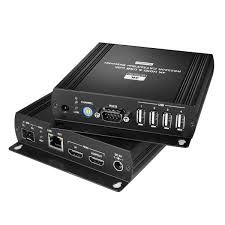
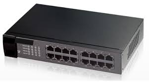

# 물리계층

물리계층이란
---

|OSI 7 LAYER|PHYSICAL LAYER|
|-|-|
|||

> 물리 계층 역할 <br>
```
물리 계층은 실제 장치들을 연결하기 위해 필요한
전기적, 물리적 세부 사항들을 정의
Ex) 핀들의 배치나 전압, 전선의 명세 등이 이 계층에 포함

```

> 물리계층의 목적<br>
```
디지털 신호 전달
```

> 물리계층 장치<br>

|-|-|-|
|-|-|-|
|케이블||케이블은 네트워크 장비나 장치를 연결하는 데 사용되는 물리적인 매체입니다.<br>주로 구리 선을 사용하며, 네트워크에서 데이터의 전송을 담당합니다.|
|-|-|-|
|리피터||리피터는 신호를 증폭하고 재생하는 장비로, 데이터를 장거리로 전송할 때 신호의 감쇄를 보상하기 위해 사용됩니다.<br>리피터는 전기적 신호를 증폭하여 신호의 손실을 최소화하고, 데이터 전송 거리를 연장합니다.|
|허브||허브는 네트워크 장치들을 연결하여 데이터를 중계하고 전송하는 역할을 합니다.<br>이전에는 네트워크 허브가 많이 사용되었지만, 현재는 스위치로 대체되는 경향이 있습니다.<br>허브는 수신한 데이터를 네트워크에 연결된 모든 장치에게 브로드캐스트하는 반면, 스위치는 목적지 장치에게만 데이터를 전달합니다.|
 

신호(SIGNAL) 란
---
> 부호란<br>
```
의미를 가지는 약속된 기호
ex) ㄱ,ㅏ,ㅇ -> 강
```
|-|
|-|
||

> 디지털 부호란<br>
```
컴퓨터가 이해하는 부호 : 0,1(이산데이터)
디지털 부호 : 0,1로 이루어진 약속된 부호
```

|-|
|-|
| |

> 신호란<br>
```
원격지로의 부호 전달
서로 떨어져 있는곳에서 부호를 써서
```

|-|
|-|
| |

> 신호전달에 필요한 요소<br>
```
부호 전달하기 위한 에너지 : 전기에너지
부호 전달하기 위한 인프라 : 통신망
```
|-|
|-|
| |


CABLE
---
> Cable 이란<br>

```
전기선
전기를 이용해서 신호를 전달하는
```

> Cable 종류<br>

> > 이더넷 케이블 (Ethernet Cable)<br>


```
 UTP (Unshielded Twisted Pair): 
   가장 흔히 사용되는 네트워크 케이블로, 카테고리별로 나뉩니다. 예를 들어, Cat5e, Cat6, Cat6a, Cat7 등이 있습니다. 
   UTP 케이블은 일반적으로 사무실이나 가정에서 사용됩니다.
 
 STP (Shielded Twisted Pair): 
   UTP와 비슷하지만, 외부 간섭을 줄이기 위해 차폐(shield)가 추가된 케이블입니다. 간섭이 많은 환경에서 사용됩니다.
```

> > 광섬유 케이블 (Fiber Optic Cable)<br>


```
싱글모드(Single-Mode Fiber, SMF): 긴 거리 전송에 적합하며, 주로 통신 사업자나 대규모 데이터 센터에서 사용됩니다.
멀티모드(Multi-Mode Fiber, MMF): 짧은 거리에서 높은 대역폭을 제공하며, 일반적으로 건물 내 또는 캠퍼스 네트워크에서 사용됩니다.
```

> > 동축 케이블 (Coaxial Cable)<br>


```
주로 케이블 TV 네트워크와 같은 특수한 애플리케이션에서 사용되며, 데이터 전송에도 사용될 수 있습니다.
과거에는 이더넷 네트워크에서도 사용되었습니다 (예: 10BASE2, 10BASE5).

```


리피터
---


```
신호 증폭 장치
```


허브
---


```
여러 대의 컴퓨터 간 통신이 가능
리피터처럼 신호를 증폭시키는 기능을 가지고 있음
발송지 데이터가 나머지 모든 컴퓨터에 전달됨
```


문제
---

|-|
|-|
|[바로가기](./01.md)|

