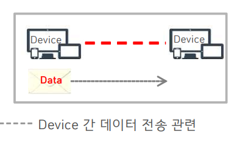

# 데이터링크

데이터 링크 계층이란
---

> 네트워크 모델 확인 <br>

|-|-|-|
|-|-|-|
||-||

> 데이터 링크 계층 역할 <br>
```
포인트 투 포인트(Point to Point) 간 운송방식 결정
```

> 데이터링크 계층의 존재 목적 <br>
```
포인트 투 포인트(Point to Point) 간 신뢰성있는 전송을 보장하기 위한 계층
```

> 데이터링크 계층의 필요 요소 <br>
```
연결된 장비간 식별 주소
오류 제어
흐름 제어
```

> 데이터링크 계층 장치
```
L2 SWITCH
Bridge
네트워크 인터페이스 카드 (NIC, Network Interface Card)
무선 액세스 포인트 (Wireless Access Point)
```

---
#
---

데이터 링크에 사용되는 프로토콜
---

> LAN<br>
```
이더넷 (Ethernet):
  가장 널리 사용되는 LAN 프로토콜로, IEEE 802.3 표준을 따릅니다.
  CSMA/CD (Carrier Sense Multiple Access with Collision Detection) 방식을 사용하여 충돌을 감지하고 처리합니다.

Wi-Fi (Wireless Fidelity):
  무선 LAN 환경에서 사용되며, IEEE 802.11 표준을 따릅니다.
  다양한 버전(802.11a, 802.11b, 802.11g, 802.11n, 802.11ac 등)이 있으며,
  주로 CSMA/CA (Carrier Sense Multiple Access with Collision Avoidance) 방식을 사용합니다.

토큰 링 (Token Ring):
  IEEE 802.5 표준을 따르며, 토큰 패싱 방식을 사용하여 네트워크 상의 충돌을 방지합니다.
  링 형태의 네트워크 토폴로지에서 사용됩니다.

FDDI (Fiber Distributed Data Interface):
  광섬유를 이용한 LAN 프로토콜로, 고속 데이터 전송을 지원합니다.
  이중 링 구조를 사용하여 장애 허용성과 신뢰성을 높입니다.
```

> WAN<br>
```
프레임 릴레이 (Frame Relay):
  데이터 패킷을 빠르고 효율적으로 전송하기 위해 설계된 프로토콜입니다.
  가상 회선(Virtual Circuit)을 사용하여 데이터를 전달합니다.

ATM (Asynchronous Transfer Mode):
  고속 네트워크 프로토콜로, 셀(cell) 단위로 데이터를 전송합니다.
  고정된 크기의 셀(53바이트)을 사용하여 일정한 지연 시간과 높은 품질의 서비스를 제공합니다.

PPP (Point-to-Point Protocol):
  두 네트워크 장비 간의 직접 연결을 통해 데이터를 전송하는 프로토콜입니다.
  다이얼업 연결이나 DSL, T1과 같은 WAN 링크에서 사용됩니다.

HDLC (High-Level Data Link Control):
  동기식 데이터 링크 제어 프로토콜로, 데이터의 흐름 제어와 오류 검출을 제공합니다.
  주로 점대점(point-to-point) 연결에 사용됩니다.

```

---
#
---
이더넷 프로토콜
---

> 이더넷 프로토콜이란<br>
```
사무실, 학교, PC 방 등의 LAN(근거리 통신망) 환경에서 거의 절대 다수를 차지하는 2계층 프로토콜
```

> 초기 이더넷 통신 방법<br>
```
CSMA/CD(Carrier Sense Multiple Access/Collision Detection) 반송파 감지 다중 엑세스 / 충돌 검출
각 노드들이 프레임을 전송하려고 공유 매체(반송파)에 접근하기 전에, 먼저 매체가 사용중인지 확인(Carrier Sensing)하며
다중접속(Multiple Access) 하는 방식
```

> 초기 이더넷 통신 문제점<br>
```
충돌 도메인 (Collision domain) 발생
이더넷 방식의 LAN에서 전송매체를 공유하고 있는 여러 단말들이 서로 경쟁하 며 충돌(Collision)이 나타나면서,
이 충돌한 프레임이 전파되어 영향을 받게되는 영역
```


> 이더넷 통신 문제 해결 방식<br>

```
초기, 공유매체 접근방식 : CSMA/CD (Half Duplex)
  - 매체 공유 : 모든 노드가 동일한 전송매체를 공유 (Shared Media)
  - 과거 초기 10 Mbps급 및 일부 100 또는 1000 Mbps 이더넷

현재, 전용매체 전이중방식 : CSMA/CD 사용 안함 (Full Duplex)
  - 전용 포트 위주의 이더넷 스위치화 및 고속화 지향 (Switched Media)
  - 1990년대 중반부터 공유매체 방식의 버스형에서 전용매체 방식의 스타형으로 발전
```

---
#
---

|문제|
|-|
|[바로가기](01.md)|


