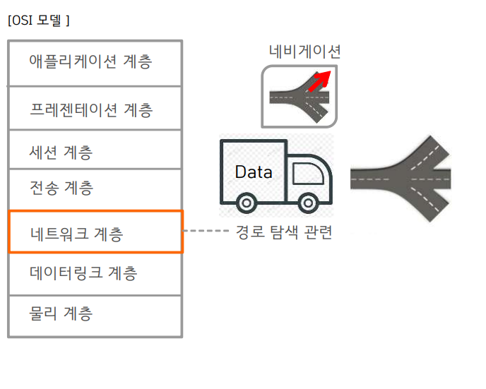
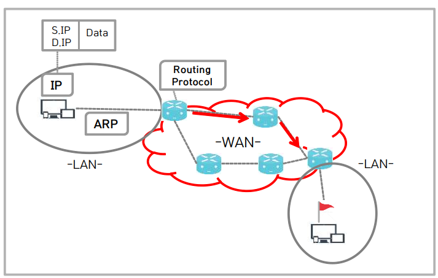

# 네트워크 계층


네트워크 계층이란
---

> 네트워크 모델 확인<br>

|-|
|-|
||

> 네트워크 계층 역할<br>
```
경로탐색
```

> 네트워크 계층의 목적
```
전달하려 하는 데이터를 목적지로 빠르고 안전한 경로로 안내하기 위한 최적경로 탐색
```

> 네트워크 계층 장치<br>
```
라우터 (Router)
레이어 3 스위치 (Layer 3 Switch)

```

---
#
---

프로토콜 종류
---

> IP<br>
```
Internet 에서 사용되는 기본 주소체계
IPv4/IPv6가 있다
```

>ICMP<br>
```
Internet Control Message Protocol 의 약어
TCP/IP에서 IP 패킷을 처리할 때 발생되는 문제를 알리거나, 진단 등과 같이
IP 계층에서 필요한 기타 기능들을 수행하기위해 사용되는 프로토콜
```

>ARP<br>
```
Address Resolution Protocol 의 약어
MAC 주소와 IP 주소를 서로 연결하는 용도로 사용한
```

>Routing Protocol<br>
```
최적 경로탐색에 사용되는 프로토콜
RIP,EIGRP,OSPF,ISIS,BGP,Static Routing ...
```

|-|
|-|
||


---
#
---
|문제|
|-|
|[바로가기](01.md)|


