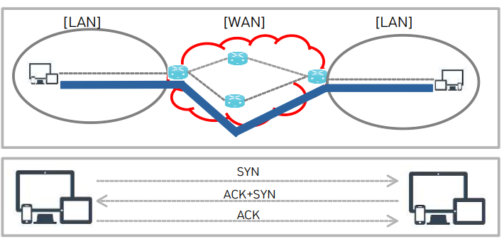

# 전송계층

전송계층이란
---

> 네트워크 모델 확인<br>


> 전송계층 역할<br>
```
종단간 데이터의 신뢰성을 보장
```

> 전송계층 목적<br>
```
전송 계층은 양 끝단(End to end)의 사용자들이 신뢰성있는 데이터를 주고 받을 수 있도록 해 주어, 상위 계층들이
데이터 전달의 유효성이나 효율성을 생각하지 않도록 해준다
```

> 전송계층 장치<br>
```
L4 SWITCH
```

---
#
---

전송계층 프로토콜
---

> TCP(Transmission Control Protocol)<br>
```
종단 호스트 내 프로세스 상호 간에 신뢰적인 연결지향성 서비스를 제공
```

> TCP 프로토콜의 역할<br>
```
1 신뢰성 : 종단간 데이터 이상유무 확인
2 연결지향 : 계속적인 데이터 교환을 위한 연결통로 설정
```



> UDP(User Datagram Protocol)<br>
```
TCP 프로토콜에 비해 구조가 단순한 전송계층 프로토콜
데이터의 빠른 전송에 적합
```

> UDP 프로토콜의 역할<br>
```
실시간 응용 및 멀티캐스팅 가능
  - 빠른 요청과 응답이 필요한 실시간 응용에 적합
  - 여러 다수 지점에 전송
```

---
#
---

|문제|
|-|
|[바로가기](./01.md)|

