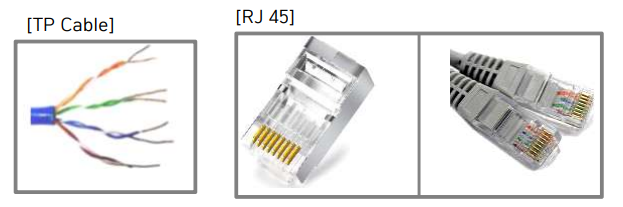
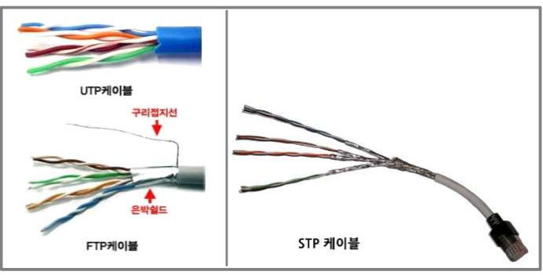
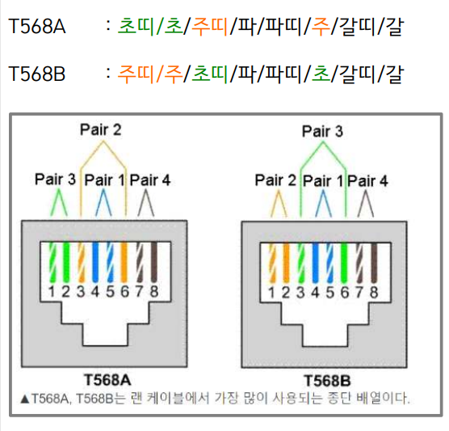
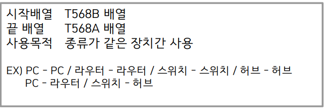
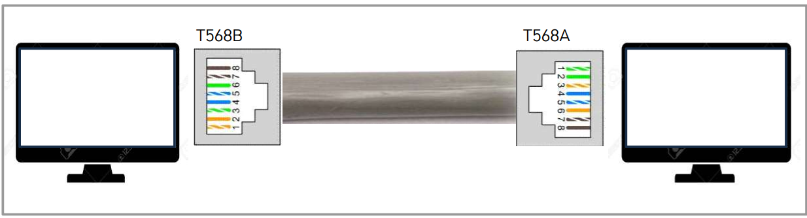
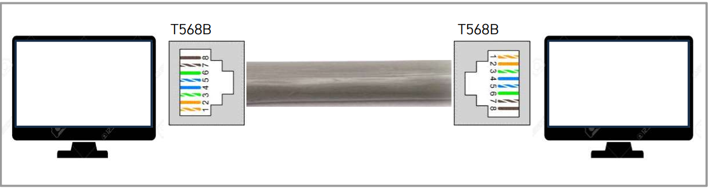
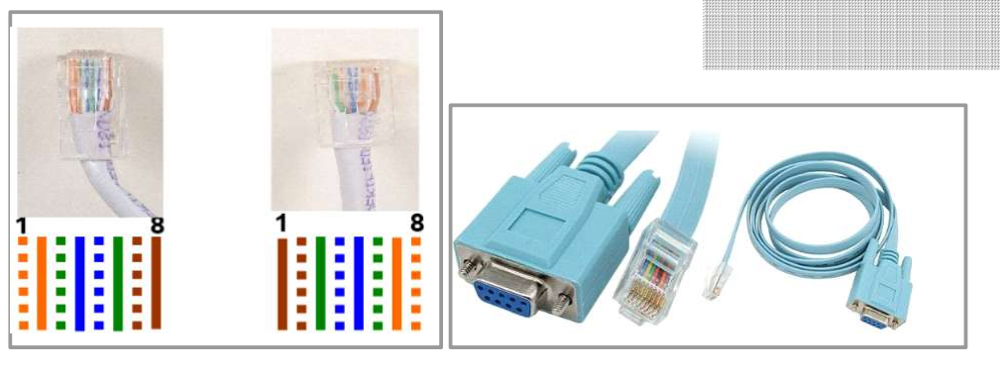

# 케이블링

케이블 기본
---

> 케이블 정의<br>
``` 
전기를 이용하여 신호를 전달하는 선
```
> LAN 케이블<br>
```
LAN(근거리통신망)에서 사용되는 케이블
TP(Twisted-Pair Cable)을 사용
총 8가닥 선으로 각 쌍 마다 꼬여진 4 쌍/페어(Pair)로 구성
```
> RJ45 Connector<br>
```
랜케이블 단자
이더넷을 지원하는 단자 사이에서 표준이 된 단자
```


> LAN 케이블 종류<br>
```
UTP(Unshielded Twisted Pair) : 차폐 기능이 없는 기본적인 랜선을 뜻하며 이론 상 전송 거리는 최대 100 m 이다.
FTP(Foil screened Twisted Pair) : 피복 안쪽에 호 일로 한 번 감싸지고 그 호일 안쪽에 구리접지선을 추가한 형 태를 한다. 이론상 150 m의 거리를 가진다.
STP(Shielded Twisted Pair) : FTP에 꼬여있는 구리선을 한 묶음으로 나누어 한 번 더 호일을 감싸 준 형태이다
```



---
#
---

케이블 배열
---

>LAN 케이블 배열형태<br>



>크로스오버 케이블(Cross-Over Cable)<br>




> 다이렉트 케이블(Straight-through Cable)<br>




> 롤오버 케이블(Straight-through Cable)<br>




---
#
---
|문제|
|-|
|[바로가기](./01.md)|


